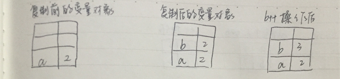
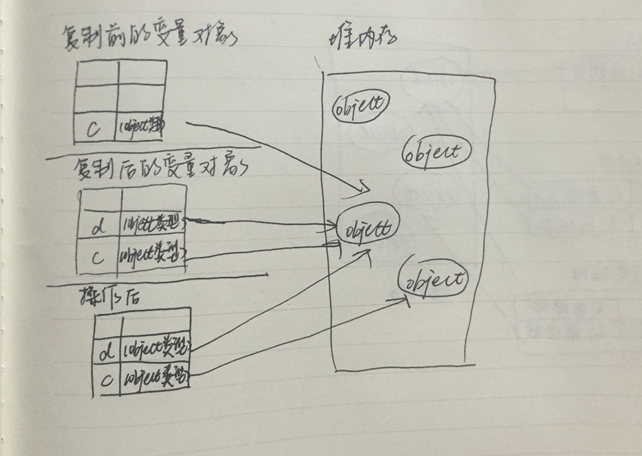

众所周知，JavaScript 中有七种内置类型：

+ 空值（null）
+ 未定义（undefined）
+ 布尔值（boolean）
+ 数字（number）
+ 字符串（string）
+ 对象（object）
+ 符号（symbol）

可以通过 `typeof` 运算符来查看值的类型。但是，这七种类型和它们的字符串值并非一一对应

```javascript
typeof undefined === 'undefined'；    // true
typeof true === 'boolean'；           // true
typeof 12 === 'number'；              // true
typeof '12' === 'string'；            // true
typeof { number: 12 } === 'object'；  // true
typeof Symbol() === 'symbol';         // true

// 而 null 有所不同
typeof null === 'null';               // false
```

事实上，对于 `typeof null` 的返回结果，是 `object`。这是 JavaScript 设计以来的一个 bug 。单单只用 `typeof` 运算符来检测 `null` 值的类型并不适用，因此我们需要用符合条件来检测：

```javascript
var a = null;
(!a && typeof null === 'object');    // true
```

<!--more-->

## 值和引用

在 JavaScript 中的赋值，分有值复制和引用复制。其中：

简单值（也就是标量基本类型值），通过值复制的方式来赋值/传递，包括 null 、undefined 、字符串、数字、布尔和 symbol 。
复合值（引用类型），对象（包括数组和封装对象）和函数，通过引用复制的方式来赋值/传递。

### 值复制

值复制的存储方式是保存在栈区的，指的是在变量对象上创建一个新值，然后把该值复制到为新变量分配的位置上。对这两个变量可以进行任何操作，但是不会相互影响。

```javascript
var a = 2;
var b = a;  // b 是 a 的一个副本
b++;
a;          // 2
b;          // 3
```



### 引用复制

引用复制的存储方式是引用存放在栈区，实际对象保存在堆区。当一个变量对另一个变量进行引用复制时，同样也会将存储在变量对象中的值复制一份到为新变量分配的空间中。不同的是，这个值的副本其实是一个指针，而这个指针指向存储在对堆中的一个对象。在进行引用复制后，连个变量实际上引用的是同一个对象。因此，改变其中一个变量，会影响另一个变量。

```javascript
var c = [1, 2, 3];
var d = c;  // d 是 [1, 2, 3] 的一个引用
d.push(4);
c;          // [1, 2, 3, 4]
d;          // [1, 2, 3, 4]
```

注意的是：引用指向的是值本身，一个引用的改变无法更改另一个引用的指向，使得另一个引用也跟着改变。

```javascript
var a = [1, 2, 3];
var b = a;
a;     // [1, 2, 3]
b;     // [1, 2, 3]

b = [4, 5, 6]
a;     // [1, 2, 3]
b;     // [4, 5, 6]
```

 b = [4, 5, 6] 表示了 b 更改其指向，可是并不影响 a 指向值 [1, 2, 3]。



### 参数传递

在函数中所有的参数都是按值传递的：

+ 简单值：把变量里的值传递给参数，之后参数和变量互不影响。
+ 复杂值：把对象变量在堆内存中的内存地址传递给参数，使得参数指向该对象。

```javascript
function foo(x) {
	x.push(4);
	x;
	
    x = [4, 5, 6];
    x.push(7);
    x;
}

var a = [1, 2, 3];

foo(a);

a;        // [1, 2, 3, 4]
```

a 指向的值是 `[1, 2, 3]` ，在向函数传递 `a` 的值的时候，实际是将引用 `a` 的一个副本赋值给 `x` ，在函数中进行 `x.push(4)` 操作，实际上是对堆内存中同一个对象的操作，`a` 和 `x` 的值都变成 `[1, 2, 3, 4]` 。当执行 `x = [4, 5, 6]` 时，参数 `x` 改变指向，此操作并不影响 `a` 的指向， `a` 仍为 `[1, 2, 3, 4]`。

## 基本包装类型

特别要说明的是，为了方便操作基本类型值，JavaScript 还提供了 3 个特殊的引用类型：`Boolean`，`Number` 和 `String`。这些类型使得我们能够通过对象的方式去操作基本类型值。

但是这些类型和上述说的引用类型有所不同，主要在于：
+ 每个包装类型都映射到同名的基本类型
+ 在读取模式下访问基本类型值时，会创建对应的基本包装类型的对象，从而方便数据操作
+ 操作基本类型值的语句一经结束，就立即销毁新创建的包装对象

```javascript
var s1 = 'some text';
var s2 = s1.toUpperCase;  // 'SOME TEXT'
```

上述例子可以想象它的执行为：

```javascript
var s1 = new String('some text');
var s2 = s1.toUpperCase;
s1 = null;
```

## 小结

+ JavaScript 中有七种内置类型：空值（null）、 未定义（undefined）、布尔值（boolean）、数字（number）、字符串（string）、对象（object）、符号（symbol）
+ 在进行值的复制的时候，基本类型的值是值复制，引用类型的值是引用复制
+ 函数中所有的参数都是按值传递的
+ 为了方便操作基本类型值，JavaScript 还提供了 3 个特殊的引用类型：`Boolean`，`Number` 和 `String`。
